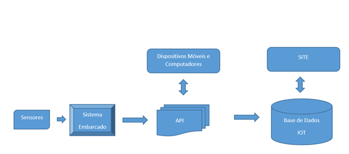

Definições
----------

.. _Dispositivo:

Dispositivo
~~~~~~~~~~~

É representado pelo conjunto de aparelhos ou mecanismos que possuam capacidade de integração e comunicação via API com a base de dados IOT, bem como realizar a comunicação e processamento com os recursos
de entrada/saída.

.. note:: Tipos de Dispositivos.

   - ESP8266.
   - Arduíno.

.. _Recurso:

Recurso
~~~~~~~

É representado pelo conjunto de recursos de entrada/saída que possuam capacidade de integração e comunicação com dispositivo.

.. _Recurso de entrada:

Recurso de Entrada
~~~~~~~~~~~~~~~~~~

É representado pelo conjunto de recursos que recebem informações da base de dados IOT.

.. note:: Tipos de Recursos de Entrada.

   - Relé.
   - Sirene.

.. _Recurso de Saída:

Recurso de Saída
~~~~~~~~~~~~~~~~

É representado pelo conjunto de recursos que enviam informações para a base de dados IOT.

.. note:: Tipos de Recursos de Saída.

   - Temperatura.
   - Umidade.
   - Distância

.. _Recurso de Entrada e Saída:

Recurso de Entrada e Saída
~~~~~~~~~~~~~~~~~~~~~~~~~~

É representado pelo conjunto de recursos que enviam e recebem informações para a base de dados IOT.

.. note:: Tipo de Recurso de Entrada e Saída.

  - xxxxxx.

.. _Fluxo de Entrada:

Fluxo de Entrada
~~~~~~~~~~~~~~~~

.. image:: ../imagem/fluxo-entrada.png
    :align: center

Um recurso de entrada recebe informações da base de dados IOT através da API. Em geral estes recursos são conectados a dispositivos
que necessitam de algum estímulo para serem ativados.

.. note:: Mundo Real. Sistema embarcado recebe ordem para ativação de um relé. Este relé poderá acionar um equipamento elétrico associado a este, tais como:

    - Motor,
    - Lâmpada,
    - Sirene,
    - Tomada etc.

.. _Fluxo de Saída:

Fluxo de Saída
~~~~~~~~~~~~~~

Um recurso de saída envia informações para a base de dados IOT através da API.
Em geral estes recursos são conectados a dispositivos que informam ou reportam dados concretos que representam alguma coisa no mundo real.

.. note:: Mundo Real. Sistema embarcado fornece dados de temperatura e umidade do ambiente. Dados são armazenados,   parametrizados e disponibilizados para acesso a usuários com permissão:

    - Temperatura,
    - Umidade,
    - Distância,
    - Luminosidade etc.

Tipos de Recurso
~~~~~~~~~~~~~~~~

Define o tipo associado ao recurso, que poderá ser de Entrada, Saída ou Entrada/Saída.

.. _Subtipos de Recurso:

Subtipos de Recurso
~~~~~~~~~~~~~~~~~~~

Define o Subtipo associado ao recurso de acordo com o seu tipo.

.. note:: O sistema IOT possui os seguintes subtipos já cadastrados

    - Binário,
    - Digital,
    - Estado,
    - Unidade,
    - Bruto.

O sistema permite o cadastramento de outros subtipos.

.. _Métrica:

Métrica
~~~~~~~

Define a forma (label) de como o Feed será apresentado na opção *Gerenciar Feed*.
Esta forma de apresentação tem a relação direta com o *Tipo de formato do subtipo*.
Tipo de formato este que poderá ser de substituição ou de concatenação.

.. important:: Exemplo de Métrica para formato do SubTipo **Substituir** - Caso de recurso Relé.

    - Para o valor do Feed 0 cadastrar na métrica *Desligado* será apresentado o label *Desligado* em Gerenciar Feed.
    - Para o valor do Feed 1 cadastrar na métrica *Ligado* será apresentado o label *Ligado* em Gerenciar Feed.

    .. image:: ../imagem/feed-rele.png
        :align: center

.. important:: Exemplo de Métrica para formato do SubTipo **Concatenar** - Caso de recurso DHT

    - Para o recurso temperatura, será concatenado ao valor lido o label **Graus** em Gerenciar Feed.

    .. image:: ../imagem/feed-temperatura.png
        :align: center
