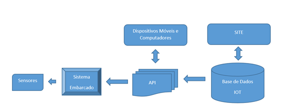

Definições
----------

.. _Dispositivo:

Dispositivo
~~~~~~~~~~~

É representado pelo conjunto de aparelhos ou mecanismos que possuam capacidade de integração e comunicação via API com a base de dados IOT, bem como realizar a comunicação e processamento com os recursos 
de entrada/saída.

.. _Recurso:

Recurso
~~~~~~~

É representado pelo conjunto de recursos de entrada/saída que possuam capacidade de integração e comunicação com dispositivo.

.. _Recurso de entrada:

Recurso de Entrada
~~~~~~~~~~~~~~~~~~

É representado pelo conjunto de recursos que recebem informações da base de dados IOT.

.. tip:: Tipos de Recursos de Entrada.
   
   - Relé.
   - Sirene.

.. _Recurso de Saída:

Recurso de Saída
~~~~~~~~~~~~~~~~

É representado pelo conjunto de recursos que enviam informações para a base de dados IOT.

.. tip:: Tipos de Recursos de Saída.
   
   - Temperatura.
   - Umidade.
   - Distância
   
.. _Fluxo de Entrada e Saída:

Fluxo de Entrada e Saída
~~~~~~~~~~~~~~~~~~~~~~~~

**Fluxo de Entrada**

Um recurso de entrada recebe informações da base de dados IOT através da API. Em geral estes recursos são conectados a dispositivos 
que necessitam de algum estímulo para serem ativados. 

.. tip:: Mundo Real.
   Sistema embarcado recebe ordem para ativação de um relé. Este relé poderá acionar um equipamento elétrico associado a este, tais como :
    - Motor, 
    - Lâmpada, 
    - Sirene, 
    - Tomada etc.

**Fluxo de Saída**

.. image:: ../imagem/fluxo-saida.png
    :align: center   

Um recurso de saída envia informações para a base de dados IOT através da API. 
Em geral estes recursos são conectados a dispositivos que informam ou reportam dados concretos que representam alguma coisa no mundo real. 

.. tip:: Mundo Real.
   Sistema embarcado fornece dados de temperatura e umidade do ambiente. Dados são armazenados,   parametrizados e disponibilizados para acesso a usuários com permissão
    - Temperatura, 
    - Umidade, 
    - Distância, 
    - Luminosidade etc.

Tipos de Recurso
~~~~~~~~~~~~~~~~

Define o tipo associado ao recurso, que poderá ser de Entrada ou Saída.

.. _Subtipos de Recurso:

Subtipos de Recurso
~~~~~~~~~~~~~~~~~~~

Define o Subtipo associado ao recurso de acordo com o seu tipo. 

.. tip:: Recurso do tipo Entrada teremos os subtipos.
    
    - Binário,
    - Dado Bruto,
    - Digital, etc.

.. tip:: Recurso do tipo Saída teremos os subtipos.

    - Estado,
    - Unidade,
    - Dado Bruto, etc.

.. _Métrica:

Métrica
~~~~~~~

Define a forma (label) de como o Feed será apresentado na opção *Gerenciar Feed*.
Esta forma de apresentação tem a relação direta com o *Tipo e Subtipo de Recurso*.

.. tip:: Exemplo de Métrica para Tipo **Entrada** e Subtipo Binário
                       
    - Para o valor do Feed 0 cadastrar na métrica *Desligado* será apresentado o label *Desligado* em Gerenciar Feed.
    - Para o valor do Feed 1 cadastrar na métrica *Ligado* será apresentado o label *Ligado* em Gerenciar Feed.

.. tip:: Exemplo de Métrica para Tipo **Saída** e Subtipo Estado

    - Para o valor do Feed 0 cadastrar na métrica *Vazio* será apresentado o label *Vazio* em Gerenciar Feed.
    - Para o valor do Feed 1 cadastrar na métrica *Metade* será apresentado o label *Metade* em Gerenciar Feed.
    - Para o valor do Feed 2 cadastrar na métrica *Cheio* será apresentado o label *Cheio* em Gerenciar Feed.
	